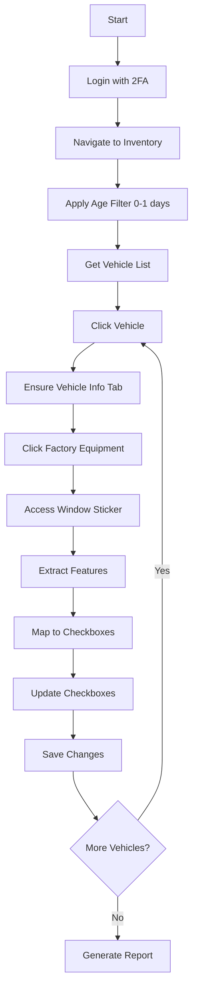

# Developer Handoff Guide - VAuto MVP Automation

## 🎯 Project Overview

This is an end-to-end automation system for VAuto that:
1. Logs into VAuto with 2FA support
2. Filters inventory for vehicles aged 0-1 days
3. Processes each vehicle by:
   - Accessing Factory Equipment window stickers
   - Extracting features from the window sticker
   - Mapping features to checkboxes using fuzzy matching
   - Updating checkboxes and saving changes
4. Generates JSON reports of all actions

## 🚀 Quick Start

```bash
# 1. Clone and install
npm install

# 2. Set credentials
export VAUTO_USERNAME="Jcopp"
export VAUTO_PASSWORD="htu9QMD-wtkjpt6qak"

# 3. Run MVP with 1 vehicle
MAX_VEHICLES=1 ./scripts/run-mvp.sh

# 4. Check results
cat reports/mvp/mvp-report-*.json
```

## 📁 Key Files to Know

### Core MVP Implementation
- **`scripts/run-mvp-end-to-end.ts`** - Main MVP script (START HERE)
- **`scripts/run-mvp.sh`** - Bash wrapper with environment setup
- **`.env.mvp`** - Environment configuration template

### Critical Services
- **`platforms/vauto/services/VehicleModalNavigationService.ts`** - Handles vehicle modal navigation
- **`core/services/WindowStickerAccessService.ts`** - Multiple strategies for accessing window stickers
- **`core/services/WindowStickerService.ts`** - Extracts features from window sticker content
- **`core/services/VAutoCheckboxMappingService.ts`** - Maps features to checkboxes with fuzzy matching

### Testing Scripts
- **`scripts/test-parsing-logic.ts`** - Test feature extraction without login
- **`scripts/test-mvp-step-by-step.ts`** - Interactive debugging
- **`scripts/test-window-sticker-and-checkboxes.ts`** - Full integration test

## 🐛 Known Issues & Fixes

### 1. Feature Extraction Bug
**Problem**: Features like "6.7L I-6 Diesel" are being split incorrectly.

**Fix**: In `core/services/WindowStickerService.ts` line 117:
```typescript
// Change this:
const delimiters = /[\n\r]+|\s*[•·-]\s*|\s*,\s*|\s*;\s*/;

// To this:
const delimiters = /[\n\r]+|\s*[•·-]\s*|\s*;\s*/;  // Remove comma delimiter
```

### 2. Missing Feature Mappings
**Problem**: Common features don't have checkbox mappings.

**Fix**: Add to `core/services/VAutoCheckboxMappingService.ts`:
```typescript
mapping.set('Power Windows', ['Power Windows']);
mapping.set('Power Door Locks', ['Power Locks', 'Power Door Locks']);
mapping.set('Bluetooth Connectivity', ['Bluetooth']);
mapping.set('Front Airbags', ['Airbags', 'Front Airbags']);
mapping.set('Side Airbags', ['Airbags', 'Side Airbags']);
```

### 3. Login URL Issues
**Problem**: Login might be at different URLs.

**Fix**: The MVP tries both:
- `https://login.vauto.com/`
- `https://signin.coxautoinc.com`

If neither works, update in `scripts/run-mvp-end-to-end.ts` line ~220.

## 🔍 Debugging Tips

### 1. Enable Debug Mode
```bash
# Run with maximum logging
LOG_LEVEL=debug HEADLESS=false SLOW_MO=3000 MAX_VEHICLES=1 ./scripts/run-mvp.sh
```

### 2. Check Selectors
If elements aren't found, use the browser DevTools:
1. Right-click element → Inspect
2. Copy selector
3. Update in `platforms/vauto/vautoSelectors.ts`

### 3. Common Failure Points

**Vehicle Not Clicking**:
- Check: `.x-grid3-row` selector still valid?
- Try: Increase `SLOW_MO` to 3000ms
- Debug: `scripts/modules/03-click-vehicle.ts` has multiple strategies

**Factory Equipment Not Found**:
- Check: Is Vehicle Info tab active first?
- Try: `scripts/modules/04-click-factory-equipment.ts` standalone
- Debug: Take screenshot to see current state

**Window Sticker Not Loading**:
- Check: Popup blocker enabled?
- Try: Different access methods in `WindowStickerAccessService`
- Debug: Check if it's inline content vs popup

### 4. Session Issues
```bash
# Clear saved session
rm -rf session/

# Clear screenshots
rm -rf screenshots/mvp/
```

## 📊 Understanding the Flow



## 🛠️ Architecture Decisions

1. **Modular Approach**: Each major step has its own module in `scripts/modules/`
2. **Service Pattern**: Business logic separated into services
3. **Retry Logic**: Built into critical operations
4. **Session Persistence**: Avoids repeated logins
5. **Multiple Strategies**: Different approaches for unreliable operations

## 📈 Performance Considerations

- **Current**: ~2-3 minutes per vehicle
- **Bottlenecks**: 
  - Window sticker loading (5-10s)
  - Checkbox updates (10-15s)
  - Page transitions (3-5s each)
- **Optimization Ideas**:
  - Parallel tab processing
  - Batch checkbox updates
  - Preload next vehicle

## 🚨 Important Environment Variables

```bash
# Required
VAUTO_USERNAME        # VAuto login username
VAUTO_PASSWORD        # VAuto login password

# Optional but recommended
HEADLESS=false        # See what's happening
SLOW_MO=2000         # Milliseconds between actions
MAX_VEHICLES=5       # Limit vehicles processed
MAX_PAGES=1          # Limit pages processed
SCREENSHOT_ON_FAILURE=true  # Debug screenshots

# 2FA Configuration
TWO_FACTOR_METHOD=sms
TWO_FACTOR_PHONE=+13137658345
WEBHOOK_URL=https://vee-otto-api.onrender.com/webhook/sms
```

## 📝 Testing Checklist

- [ ] Run `npm test` - All unit tests pass
- [ ] Run `npx ts-node scripts/test-parsing-logic.ts` - Feature extraction works
- [ ] Run `npx ts-node scripts/test-mvp-basics.ts` - Dependencies verified
- [ ] Login manually once to verify credentials
- [ ] Run MVP with 1 vehicle
- [ ] Check JSON report generated correctly
- [ ] Verify checkboxes were actually updated in VAuto

## 🔄 Continuous Improvement

1. **Monitor Success Rates**: Check reports/mvp/ for patterns
2. **Update Selectors**: VAuto UI changes frequently
3. **Add Feature Mappings**: Based on unmapped features in reports
4. **Adjust Timeouts**: Based on network/server speed

## 💡 Pro Tips

1. **Use Modular Scripts for Debugging**: 
   ```bash
   npx ts-node scripts/modules/01-login-and-2fa.ts
   npx ts-node scripts/modules/02-navigate-to-inventory.ts
   npx ts-node scripts/modules/03-click-vehicle.ts
   npx ts-node scripts/modules/04-click-factory-equipment.ts
   ```

2. **Save Time with Session Persistence**:
   - Session saved in `session/auth-session.json`
   - Valid for ~30 minutes
   - Skips login on subsequent runs

3. **Debug Specific Vehicles**:
   - Note the vehicle index that fails
   - Set `MAX_VEHICLES` to that number
   - Run with `HEADLESS=false` to watch

4. **Feature Mapping Strategy**:
   - Exact matches first (100% confidence)
   - Fuzzy matches second (60-90% confidence)
   - Log unmapped features for manual review

## 📞 Support & Resources

- **Test Data**: See `scripts/test-parsing-logic.ts` for mock data
- **Selector Reference**: `platforms/vauto/vautoSelectors.ts`
- **Previous Issues**: Check git history for selector updates
- **Logs**: Always check `logs/mvp-*.log` for detailed errors

## 🎯 Success Metrics

A successful run should show:
- ✅ Login success rate: 100%
- ✅ Vehicle navigation: >95%
- ✅ Factory Equipment access: >90%
- ✅ Feature extraction: >80% of features mapped
- ✅ Checkbox updates: >75% accuracy

Good luck! The foundation is solid - just needs fine-tuning for the current VAuto UI. 🚀