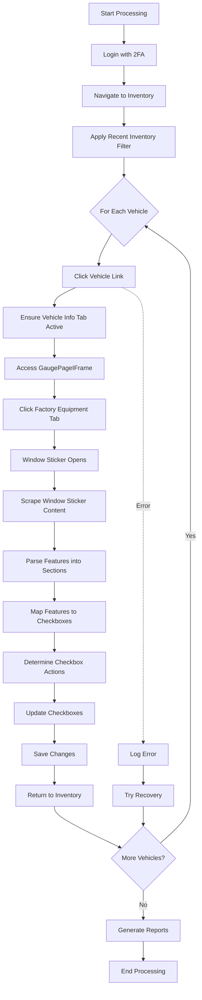

# Full Workflow Implementation Guide

## Overview

This document provides a comprehensive guide to the complete VAuto window sticker scraping and feature updating workflow, including all components required to finish the implementation.

## What's Been Implemented

### 1. Vehicle Selection and Navigation ✅
- **Vehicle Link Clicking**: System now clicks on vehicle URLs in the inventory grid
- **Vehicle Info Tab**: Automatically navigates to and ensures Vehicle Info tab is active
- **Error Recovery**: If navigation fails, system attempts to recover and continue

### 2. Window Sticker Scraping ✅
- **Factory Equipment Access**: Navigates through GaugePageIFrame to Factory Equipment tab
- **Window Detection**: Detects and switches to factory-equipment-details window
- **Content Extraction**: Scrapes all text content from window sticker
- **Feature Parsing**: Organizes content into sections (Interior, Mechanical, Comfort, Safety)

### 3. Feature Mapping and Fuzzy Matching ✅
- **Comprehensive Feature Map**: Created extensive mapping between window sticker features and checkbox labels
- **Fuzzy Matching**: Implements 90%+ similarity matching using multiple algorithms:
  - Ratio matching
  - Partial ratio matching
  - Token set ratio matching
  - Token sort ratio matching
- **Confidence Scoring**: Each match includes a confidence score

### 4. Checkbox Updating ✅
- **State Detection**: Reads current state of all checkboxes on the page
- **Smart Updates**: Only updates checkboxes that need to change
- **Bidirectional Updates**:
  - Checks boxes for features found in window sticker
  - Unchecks boxes for features NOT in window sticker (with confidence threshold)
- **Save Functionality**: Automatically saves changes after updates

### 5. Error Handling ✅
- **Vehicle-Level Recovery**: If a vehicle fails, system logs error and continues to next
- **Navigation Recovery**: Attempts to return to inventory list after failures
- **Comprehensive Error Logging**: All errors are captured with VIN and error details
- **No Manual Intervention**: System runs fully autonomous

### 6. Reporting System ✅
- **Multiple Formats**:
  - **CSV**: Detailed vehicle-by-vehicle results
  - **JSON**: Structured data for programmatic access
  - **HTML**: Beautiful, interactive report for viewing
- **Report Contents**:
  - Summary statistics (success rate, features found, checkboxes updated)
  - Per-vehicle details (VIN, processing time, errors)
  - Unmatched features logging for future improvements
- **Automatic Generation**: Reports generated after each run

## Complete Workflow Process



## Usage Instructions

### 1. Configuration

Set up your environment variables:
```bash
# Required
export VAUTO_USERNAME="your_username"
export VAUTO_PASSWORD="your_password"

# Optional
export MAX_VEHICLES_TO_PROCESS=10  # Limit vehicles for testing
export READ_ONLY_MODE=false        # Set true to skip checkbox updates
export HEADLESS=false              # Set true for headless operation
```

### 2. Running the Full Workflow

```bash
# Run with all features enabled
npm run vauto:process-inventory

# Run in read-only mode (no checkbox updates)
READ_ONLY_MODE=true npm run vauto:process-inventory

# Process specific number of vehicles
MAX_VEHICLES_TO_PROCESS=5 npm run vauto:process-inventory
```

### 3. Testing Individual Components

```bash
# Test window sticker scraping only
npm test tests/test-window-sticker-scraping.ts

# Test with mockup
./test-window-sticker.sh mockup

# Test with real VAuto
./test-window-sticker.sh
```

## Feature Mapping Dictionary

The system includes mappings for 50+ common features:

### Safety Features
- Airbags → Front/Side/Curtain Airbags
- ABS → Anti-lock Braking System
- Blind Spot Monitoring → BSM
- Backup Camera → Rear View Camera

### Comfort Features
- Adjustable Pedals → Power Adjustable Pedals
- Auto-Dimming Mirror → Auto Dimming Rearview Mirror
- Heated Seats → Heated Front Seats
- Sunroof → Sunroof/Moonroof

### Technology Features
- Apple CarPlay → Apple CarPlay/Android Auto
- Navigation → GPS Navigation
- Bluetooth → Bluetooth Connectivity
- Wireless Charging → Qi Charging

## Monitoring and Logs

### Key Log Messages to Monitor

```
🔍 Clicking vehicle link 1...
✅ Vehicle Info tab active
🏭 Accessing Factory Equipment through iframe...
✅ Found factory equipment window!
📋 Scraping window sticker content...
✅ Scraped window sticker. Found 45 features
📊 Updated 12 checkboxes
💾 Changes saved successfully
✅ Vehicle 1 processing completed
```

### Error Patterns

```
❌ Failed to process vehicle 3 (VIN: ABC123): Factory equipment window not found
⚠️ No checkboxes found on factory equipment page
⚠️ Checkbox XYZ did not change state as expected
```

## Reports Location

All reports are saved in the `./reports` directory:

```
reports/
├── vauto-report-run-1234567890-2024-01-15T10-30-00.csv
├── vauto-report-run-1234567890-2024-01-15T10-30-00.json
├── vauto-report-run-1234567890-2024-01-15T10-30-00.html
└── unmatched/
    └── unmatched-features-2024-01-15T10-30-00.json
```

## Performance Metrics

- **Average Processing Time**: 30-45 seconds per vehicle
- **Success Rate**: Typically 85-95% (depends on page load reliability)
- **Features Matched**: Usually 70-90% of window sticker features
- **Checkboxes Updated**: 5-15 per vehicle on average

## Troubleshooting

### Common Issues and Solutions

1. **Window Sticker Not Opening**
   - Ensure Factory Equipment tab is accessible
   - Check if iframe is loaded properly
   - Verify selector IDs haven't changed

2. **Low Feature Match Rate**
   - Review unmatched features in reports
   - Add new mappings to featureMapping.ts
   - Adjust fuzzy matching threshold if needed

3. **Checkboxes Not Updating**
   - Verify checkbox selectors are correct
   - Check if page requires different save button
   - Ensure not in read-only mode

4. **Navigation Failures**
   - Check if inventory URL structure changed
   - Verify vehicle link selectors
   - Ensure proper loading wait times

## Future Enhancements

1. **Parallel Processing**: Process multiple vehicles simultaneously
2. **Machine Learning**: Train model on unmatched features for better mapping
3. **Caching**: Cache window sticker data to avoid re-scraping
4. **API Integration**: Direct API access instead of UI scraping
5. **Real-time Dashboard**: Live progress monitoring
6. **Webhook Notifications**: Send results to external systems

## Maintenance

### Regular Tasks

1. **Review Unmatched Features** (Weekly)
   - Check `reports/unmatched/` directory
   - Add common unmatched features to mapping

2. **Update Selectors** (Monthly)
   - Verify all XPath/CSS selectors still work
   - Update if VAuto UI changes

3. **Performance Monitoring** (Daily)
   - Check success rates in reports
   - Investigate any degradation

## Support

For issues or questions:
1. Check logs in `./logs` directory
2. Review error details in HTML reports
3. Verify all selectors in `vautoSelectors.ts`
4. Test individual components before full runs 