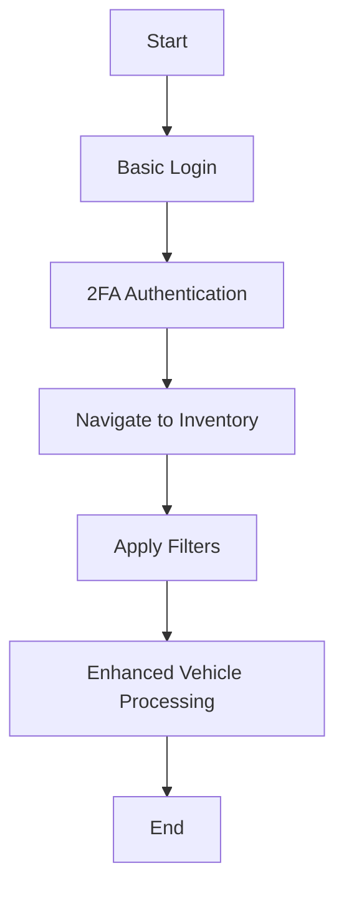

# Hybrid VAuto Implementation Plan

## Objective
Combine the strengths of both existing scripts:
- Robust 2FA/navigation from `run-full-workflow.ts`
- Enhanced vehicle processing from `run-enhanced-vehicle-processing.ts`

## Implementation Strategy

### 1. Create New Hybrid Script
```typescript
// scripts/run-hybrid-vehicle-processing.ts
#!/usr/bin/env node

import * as dotenv from 'dotenv';
import { chromium, Browser, Page } from 'playwright';
import { Logger } from '../core/utils/Logger';
import { TaskOrchestrator } from '../core/services/TaskOrchestrator';
import {
  basicLoginTask,
  twoFactorAuthTask,
  navigateToInventoryTask,
  applyInventoryFiltersTask
} from '../platforms/vauto/tasks/VAutoTasks';
import { enhancedVehicleProcessingTask } from '../platforms/vauto/tasks/EnhancedVehicleProcessingTask';

// Load environment variables
dotenv.config();

const logger = new Logger('HybridVehicleProcessing');

interface HybridConfig {
  username: string;
  password: string;
  webhookUrl?: string;
  headless?: boolean;
  slowMo?: number;
  maxVehiclesToProcess?: number;
  readOnlyMode?: boolean;
  runSpecificTasks?: string[];
  useSemanticFeatureMapping?: boolean;
  semanticSimilarityThreshold?: number;
  semanticMaxResults?: number;
}

async function runHybridVehicleProcessing() {
  let browser: Browser | null = null;
  let page: Page | null = null;
  
  try {
    logger.info('🚀 Starting Hybrid VAuto Vehicle Processing');
    
    // Configuration
    const config: HybridConfig = {
      username: process.env.VAUTO_USERNAME || '',
      password: process.env.VAUTO_PASSWORD || '',
      webhookUrl: process.env.PUBLIC_URL ? `${process.env.PUBLIC_URL}/api/2fa/latest` : 'http://localhost:3000/api/2fa/latest',
      headless: process.env.HEADLESS === 'true',
      slowMo: parseInt(process.env.SLOW_MO || '1000'),
      maxVehiclesToProcess: parseInt(process.env.MAX_VEHICLES_TO_PROCESS || '5'),
      readOnlyMode: process.env.READ_ONLY_MODE === 'true',
      useSemanticFeatureMapping: process.env.USE_SEMANTIC_MAPPING === 'true',
      semanticSimilarityThreshold: process.env.SEMANTIC_THRESHOLD ? parseFloat(process.env.SEMANTIC_THRESHOLD) : 0.8,
      semanticMaxResults: process.env.SEMANTIC_MAX_RESULTS ? parseInt(process.env.SEMANTIC_MAX_RESULTS) : 5
    };
    
    // Validate configuration
    if (!config.username || !config.password) {
      throw new Error('Missing required environment variables');
    }
    
    // Initialize browser
    browser = await chromium.launch({
      headless: config.headless,
      slowMo: config.slowMo,
      args: ['--no-sandbox', '--disable-dev-shm-usage']
    });
    
    const context = await browser.newContext({
      viewport: { width: 1920, height: 1080 }
    });
    
    page = await context.newPage();
    
    // Create task orchestrator
    const orchestrator = new TaskOrchestrator('Hybrid-VAuto-Automation');
    
    // Hybrid tasks sequence
    const hybridTasks = [
      basicLoginTask,
      twoFactorAuthTask,
      navigateToInventoryTask,
      applyInventoryFiltersTask,
      enhancedVehicleProcessingTask
    ];
    
    // Register tasks
    hybridTasks.forEach(task => orchestrator.registerTask(task));
    
    // Execute tasks
    const startTime = Date.now();
    const results = await orchestrator.executeAll(page, config);
    const totalTime = Date.now() - startTime;
    
    logger.info(`✅ Hybrid automation completed in ${(totalTime/1000).toFixed(1)}s`);
    
    // Process results
    const vehicleResult = results.get('enhanced-process-vehicles');
    if (vehicleResult?.success) {
      logger.info(`🚗 Processed ${vehicleResult.data?.processedVehicles} vehicles`);
    }
    
  } catch (error) {
    logger.error('❌ Hybrid automation failed:', error);
    process.exit(1);
  } finally {
    if (page) await page.close();
    if (browser) await browser.close();
  }
}

runHybridVehicleProcessing().catch(error => {
  logger.error('Fatal error:', error);
  process.exit(1);
});
```

### 2. Update package.json
Add new script command:
```json
// package.json
"scripts": {
  "vauto:hybrid": "ts-node scripts/run-hybrid-vehicle-processing.ts"
}
```

### 3. Key Integration Points
1. **Robust Authentication Flow**:
   - Uses the proven 2FA handling from `run-full-workflow.ts`
   - Leverages existing Auth2FAService implementation

2. **Enhanced Vehicle Processing**:
   - Incorporates the reliable Vehicle Info tab handling
   - Utilizes the factory equipment PDF access methods

3. **Error Handling**:
   - Maintains comprehensive logging from both implementations
   - Includes fallback mechanisms for navigation failures

### 4. Execution Workflow


## Next Steps
1. Switch to Code mode to implement the hybrid solution
2. Create the new script file at `scripts/run-hybrid-vehicle-processing.ts`
3. Update package.json with the new command
4. Test execution with: `npm run vauto:hybrid`